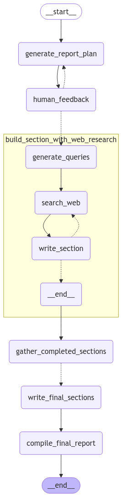

# NexusMind AI — Deep Research Agent Web App

​NexusMind AI is an advanced research assistant that automates the generation of in-depth research reports. By leveraging cutting-edge **natural language processing (NLP)**, **multi-turn feedback loops**, and modern web technologies, it enables users to interact dynamically to refine and produce structured reports. At its core, NexusMind AI integrates **Open Deep Research** from LangGraph, a customizable web research assistant that generates comprehensive reports on any topic. 

## Features
- **Conversational AI for Research**: Users can input a research topic, receive structured outlines, and refine results through iterative feedback.
- **Multi-Turn Feedback Loop**: The AI dynamically improves the research content based on user feedback.
- **PDF Report Generation**: Converts final research results into downloadable PDF reports.
- **Speech-to-Text Support**: Enables voice-based topic input and interaction.
- **Dark Mode**: User-friendly theme switching between light and dark modes.
- **Automatic Conversation Reset**: Restarts the conversation while preserving the final report.

## How It Works  

1. **Start a Research Session**  
   - The user enters a research topic in the chat.  
   - The AI generates an initial structured outline and report plan.  

2. **Iterate with Feedback**  
   - The AI asks for feedback before finalizing the report.  
   - The user can request refinements or approve the current version.  

3. **Generate the Final Report**  
   - Once approved, the AI completes the research report.  
   - The report is structured and formatted based on best practices.  

4. **Download the Report as a PDF**  
   - The user can download the report as a well-formatted PDF.  

5. **Restart the Conversation**  
   - The system clears previous interactions and allows the user to start fresh with a new topic while preserving access to previous reports.  

## Deep Research Agent Workflow  

NexusMind AI uses **two specialized agents** to generate high-quality research reports:  

1. **Report Planning Agent** – This agent generates a structured **report plan** and sections based on the given topic.  
2. **Final Report Generation Agent** – Once the research is complete, this agent **compiles and refines** the sections into a well-structured final report.  

The diagram below illustrates the complete workflow:  

  

### Workflow Breakdown  
1. **Generate Report Plan** – The AI structures an initial plan for the research report.  
2. **Incorporate Human Feedback** – Users review and refine the plan before proceeding.  
3. **Conduct Web Research** – The AI generates search queries, gathers relevant information, and writes sections iteratively.  
4. **Assemble Completed Sections** – All researched sections are gathered together.  
5. **Write Final Sections** – The AI compiles the sections into a cohesive report.  
6. **Compile Final Report** – The final document is structured and prepared for download.  

This multi-agent approach ensures a **customizable, iterative, and high-quality** research generation process.  


## Technologies Used
### Backend (FastAPI)
- **FastAPI** (Python) – High-performance API framework.
- **LangGraph & LangChain** – Handles deep research agent creation.
- **OpenAI API** – Powering language generation.
- **Tavily Search API** – Fetches relevant web content for research.
- **Deepgram API** – Speech-to-text transcription.
- **PDFKit & Markdown** – Generating structured reports in PDF format.
- **Docker** – Containerization for easy deployment.

### Frontend (React.js)
- **React.js** – Interactive UI development.
- **Tailwind CSS** – Modern styling for UI.
- **Axios** – API communication.
- **React Markdown & Highlight.js** – Renders research results with rich formatting.

### Deployment
- **Docker Compose** – Manages both frontend and backend services.

## Project Structure
```
NexusMind-AI/
├── backend/                              # Backend service
│   ├── Dockerfile                        # Backend container setup
│   ├── requirements.txt                  # Python dependencies
│   └── app/
│       ├── __init__.py                   
│       ├── main.py                       # FastAPI app entry point
│       ├── api/
│       │   ├── __init__.py  
│       │   └── routes.py                 # API endpoints
│       └── core/
│           ├── __init__.py
│           ├── deep_research_agent.py    # AI-powered research agent
├── frontend/                             # Frontend service
│   ├── Dockerfile                        # Frontend container setup
│   ├── package.json                      # Node.js dependencies
│   ├── postcss.config.js                 # PostCSS configuration
│   ├── tailwind.config.js                # Tailwind CSS setup
│   ├── public/
│   │   └── index.html                    # Main HTML entry
│   └── src/
│       ├── App.js                        # Root React component
│       ├── index.js                      # React app entry point
│       ├── components/
│       │   ├── Navbar.js                 # Navigation bar
│       │   └── ChatBox.js                # Main chat interface
│       ├── pages/
│       │   ├── Home.js                   # Home page
│       │   ├── About.js                  # About page
│       │   └── Contact.js                # Contact page
│       └── utils/
│           └── downloadPdf.js            # PDF generation utility
└── docker-compose.yaml                   # Orchestration for frontend & backend
```

## Installation & Setup
### Prerequisites
- **Docker** & **Docker Compose** installed.

### Running with Docker
1. Clone the repository:
   ```bash
   git clone https://github.com/yourusername/NexusMind-AI.git
   cd NexusMind-AI
   ```
2. Start the services using Docker Compose:
   ```bash
   docker compose up --build
   ```
3. Access the web app at **http://localhost:3000**.

## API Endpoints
| Endpoint               | Method | Description |
|------------------------|--------|-------------|
| `/api/start_research`  | POST   | Start a research session |
| `/api/resume`          | POST   | Resume research with feedback |
| `/api/generate_pdf`    | POST   | Convert research to PDF |
| `/api/transcribe`      | POST   | Convert speech to text |
| `/api/reset`           | POST   | Reset conversation & AI memory |

---
**Developed by RJ Aca-ac**

